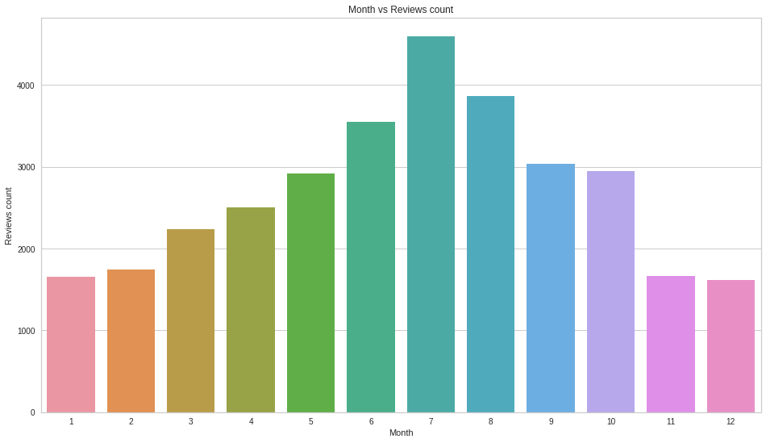

https://colab.research.google.com/drive/1NLTTTkGXKRbnZRTvtEehd_xyAXn2GkiI?usp=sharing
### Abstract 

*Sentiment analysis, the extraction of underlying meaning of reviews of positive and negative is becoming one of the most attractive tools for researchers and businesses to group customer feedback and better determine their desires and needs. Recommender systems are also becoming more and more important in the marketing industry, to streamline targeted advertising. Natural language processing, machine learning and neural network approaches on large volumes of text, make it possible to extract sentiment analysis and build recommender systems. In this project we will build these two tools based on European hotel reviews.*

*The main goal is using neural network models for sentiment analysis on the text data set which includes reviews of Hotels, and comparing performance with other classification algorithms. We also would like to explore how to use this result as a feature in different applications such as recommender systems.*

### Introduction

Sentiment analysis is the automated process of understanding the sentiment or opinion of a given text. It is one of the most common classification algorithms. The sentimental tool analyzes the reviews with Natural Language Processing, Machine Learning and Neural Network approaches to evaluate whether the underlying sentiment of a small text is positive, negative or neutral. This is usually some form of customer feedback or review, for example: customer service, an item on an ecommerce website, or, as used in this project hotel reviews.
The goal is to apply different approaches (train different models) on a sample of European Hotel Reviews to determine the sentiment of each review. We will then compare the results and metrics of each model’s attempt at determining the sentiment of an unseen review (testing) and determine the best performing algorithm. These reviews, and most reviews in general, are technically labelled, as the user will likely be asked to include a quantifiable review (out of 5 stars). However, the value added by these experiments is the learning done by the data models, so that they may quantify unlabelled data, or even follow up with customers whose ratings don’t match the sentiment expressed in their review text. Determining which model performs best will offer better results with respect to these goals. 
The secondary goal is to use the result of sentimental analysis, along with some other features that will be extracted, is to create a recommender system. The recommender system provides hotels that are more relevant to the search item or are close to the search history of the user and analyzed preferences of the user. The aim of the recommender system is to improve the quality of search results and recommend certain hotels that are more likely to interest certain users.

### Materials and Methods

The dataset is composed of 35,000 data, pulled from [Kaggle](https://www.kaggle.com/datafiniti/hotel-reviews). Each data instance (row) corresponds to one review of a hotel in Europe. Of the nineteen columns in the table, some provided features include hotel location, name, rating, review text, username, etc. A random sample of 10,000 will be selected, Training and testing data will be randomly shuffled and then split into 80/20, respectively. So we will have 800 samples for training and 200 for testing the models. 

Example of Row:

#### Sentiment Analysis
For sentiment analysis, we will mostly be interested in features: review.text and review.date, review.rating. The first step is to analyze review.text to prepare for pre processing and feature engineering. Given review.text is text data, we need to recognize what information (words) included in this text is useful for NLP approaches and what is not. After extracting useful information from the review.text, we apply some feature engineering on reviews.rating and review.date to create more valuable features. We apply simple linear regression to the dataset  and then by calculating least square error we figured that we have a linear data set.  As a result of that we consider applying multiple Machine Learning and Neural Network algorithms on our dataset.

Mostly we are going to work on the review column and apply some text preprocessing to clean the data. We assume that data requires lots of preprocessing since the reviews are written by users and they include lots of unnecessary stopwords and parts of speech which are not useful for feeding into text classification models. The reviews are multilingual, we will focus on English reviews, and therefore implement some filtering with respect to the language used. Since the data is text, we also need to do some vectorization to convert it to numeric data to be able to use it for training models. Also, the data set is unlabeled so we need to do some feature engineering to create labels for example by using the rating column. 

#### Recommender System
For the recommender system, because we want to try all the different approaches such as democratic and collaborative filtering, and content based filtering. 
Content-based filtering will recommend a similar hotel based on a particular review. The idea behind this system is that if a person liked a hotel and gave a positive review, they will also like a hotel with a similar review.We will calculate pairwise similarity scores for all hotels based on their reviews and recommend hotels based on that similarity score. We will use Term Frequency-Inverse Document Frequency to transform the reviews into vectors.
Demographic filtering gives  a  generalized  recommenda-tions to every user,  based on popularity of the hotel. We will need a metric to calculate the score for each hotel, then we sort  hotels based on their scores and return the best rated ones as the recommendation. We will use the IMDb’s rating system formula to calculate the score for each hotel.

#### Methodology & Experimental Results

### Sentimental Analysis
For Sentimental Analysis, we mostly use the following features reviews.text and reviews.date, reviews.rating. 
The first step is analyzing reviews.text which are text data and as a result we need to recognize what is useful and what is not with using NLP approaches. After extracting useful information from the reviews.text, we apply some feature engineering on reviews.rating and reviews.date to create more valuable features.
We apply simple linear regression to the dataset and then by calculating least square error we figured that we have a linear data set. As a result of that we consider applying multiple Machine Learning and Neural Network algorithms on our dataset.

### NLP Pre-processing

Our data is a multi-language data and we only keep the English reviews. 

After removing NaN values and doing some normalization we applied the following steps to get a clean data, which is ready for use in the algorithms:

For embedding we used Count Vectorizer on our bad of words mode, in this method 
our text data is been converted to a to a matrix of token counts. 

The sample data after pre-processing is:

Same review after pre-processing

Challenges that we face include Slang, sarcasm, culture and multi-languages.
Some words can have positive values but when they combine with other words the underlying meaning changes. 
Also, by removing the non English reviews we lost some information. As a substitution we could use Python translation library. Since, translation in this way might not convert the exact meaning, it is possible that we don't get accurate result. 

### Feature Engineering

We limited our data set to name, reviews.rating, reviews.text and reviews.preprocessed.
The reviews.rating is a feature that users give a rate to a hotel between 1-5. The distribution of this rating is as follows:

Reviews rating distribution.

For our purpose of creating a Sentimental tool we need a 0-1 label for each review. We use the reviews.rating column and create a new feature names "feedback" with the following values:\\
 if the reviews.rating \< 3
 if the reviews.rating == 5

T-SNE distribution of positive and negative reviews

We have a categorical column "name" and we change it to binary variables with use of dummy variables and then concatenate the results. This step is necessary because we can not use categorical features in the algorithms.

Now, we have a dataframe with numeric labeled data which is ready to be fit in the algorithms. 

Also, we use reviews.date to extract month, year and day to use in our recommendation tool and data exploration.

### Data Exploration
After preparing the data, we did a bit of data visualization to understand our data more and to see which features are more useful for our targets. 
The following bar chart shows the number of reviews per months, and we can see the number of reviews are higher in the summer. We consider using month as a feature to be used in the recommendation system. 

Number of reviews per months.

We also extracted the most frequent keywords and illustrate them with word cloud to see what exactly we gain. Following images shows that the most repetitive words are hotel, stayed and night which are not really useful for our purpose also has effect on the tf-idf score. 

Most frequent words

We decide to use NLP POS Tags to keep the adjectives in order to avoid the non necessary repetitive words.

Another approach that we try is creating bi-grams from the pre-processed data to see if the combination of words make more sense to use in the algorithms. 

Bi-grams for positive, negative and neutral reviews.

### Neural Network Classification Algorithms
We use Keras and Tensorflow libraries and experimented with ANN, CNN, RNN approaches. 

ANN is a group of multiple perceptron at each layer and known as Feed-Forward Neural network. We made two different versions of ANN model with 2 hidden layers with 400 unites with relu activation function. But we differentiate ANN versions by using different activation function on output later so that one can output the Positive/Negative segmentation from sigmoid and the other can output the 1-5 Score of positiveness from softmax. 
ANN cannot capture sequential information in the input data which is needed in most of NLP so we decided to experiment with CNN, RNN.

RNN is made by looping constraint on the hidden layer of ANN. This looping constraint ensure that sequential information is capture in the input data because the output at each step depends not only on the current word but also on the previous words. We imported LSDM from Keras and inserted 2 layers with 128 Unites, 64 unites each at first. However, due to our limited computing power, we experienced that RNN takes a lot of resources and it crashed at first. So we had to reduced the size of unites to 32 and 16 each and it resulted with poor performance.

CNN are sliding window function(filter) that summarize its feature by multiplying its value with the matrix. Then, it can extract relevant information and applies this matrix especially to a image. But how about the text?
Images are points in space, just like the word vectors are. By embedding/vectorizing each words on top of each other, we can get an image from text. And we applied the matrix over word embedding and went through Max Pooling to form a single feature vector which reduced dimensionality. We also experienced hardware limitation. But, it performed much better than RNN given the same amount of training time.

### Machine Learning Classification Algorithms

We fit our data into following estimators: 

  item Gaussian Naive Bayes  
  item Random Forest
  item SVM linear and rbf kernel

 For this aim We use scikit-learn library to separate train and test data with the 80-20 rule and we define models of each estimator, fit the data and calculate the scores. Based on our experiment, we get the hight score for SVM linear kernel. 
 
We experimented with different types of SVM kernel such as linear, poly, rbf. We expected that polynomial or rbf would give better performance as we initially believe that it require higher dimensional space to linearly separate the data. So How should I select SVM kernels? In order to distinguish if our data is linear or nonlinear, We made a Linear Regression model. The idea is to apply simple linear regression to the dataset and then to check least square error. If the least square error shows high accuracy, it implies the dataset being linear in nature, else dataset is non-linear. With this experiment, high score  appeared with Linear Regression and we could confidently select Linear Kernel on our SVM model.

### Measures
Among eight methods that we applied, ANN shows the best score. As we can see in the following learning curve, after 3 epochs, the loss amount dropped significantly. And at its 10th epochs, it shows 98\% of accuracy. Unless RNN and CNN model which resulted only 70\% accuracy after 6th epochs.

ANN learning curve.

We expected to get better result from LMTS but due to limited GPU, the number of epoches we try is fewer than ANN, so we can not really get the result we expected. 
In the future, we want to experiment more with RNN with normalization or dimentionality reduction because it can interpreted sequantial data, it is more suitable to use it for NLP. 

The confusion matrix of ANN shows the positive results. 

ANN confusion matrix.

### Recommendation System
For recommendation system we used two approaches: demographic filtering and content based filtering 
We could not apply Collaborative Filtering on our data set, because Collaborative Filtering finds the user interest based on their history and we do not have enough information in this data set to cover this feature.   
### Demographic Filtering
Demographic filtering gives a generalized recommendations to every user, based on popularity of the hotel. 
We need a metric to calculate the score for each hotel, then we sort hotels based on their scores and return the best rated ones as the recommendation. 
We consider to use the IMDb's rating system formula to calculate the score for each hotel \textsuperscript{2}:
\[
\mbox{IMDb Weighted Rating} = \frac{v}{v+m} \times R + \frac{m}{v+m} \times C
\]
where \\
\hspace{1cm}v: number of reivew in hotel\\
\hspace{1cm}c: mean of all  review score\\
\hspace{1cm}m: 4\\

The following image shows sentimental score from IMBd's formula which are well calculated and matched with the true score(feedback). There are some part like in neutral that passed under 2.0, and over 4.0 but overall it is good. 

sentimental score from that IMDb's formula

### Content Based Filtering
Content-based filtering recommend the similar hotel based on a on a particular review. The idea behind this systems is that if a person liked a hotel and gave positive review, they will also like a hotel with the similar review.
We calculate pairwise similarity scores for all hotels based on their reviews and recommend hotel based on that similarity score. 
In this section we used Term Frequency-Inverse Document Frequency  to transform the reviews into vector.

TF-IDF relative is the measure of importance of a word to the documents. 
\[ TF-IDF = TF \times IDF \] where
\[
TF = \frac{\mbox{Number of times a word appears in a document}}{\mbox{Total number of words in that document}}
\]
\[
IDF = log \frac{\mbox{Total number of documents}}{\mbox{Number of documents with the term in it}}
\]
With the TF-IDF matrix along with cosine similarity scores, we calculate the similarity between each two hotel reviews. Calculating the dot product of TF-IDF matrix give the cosine similarity score. 
The following example shows the similar hotels to the 'Ambassadors Inn and Suites' based on their similar reviews. 

Content-based Filtering Recommendation System

### Conclusions

In the text processing, knowing the audience and business is so important in order to understand the meaning of the words and necessity of keeping the words. Implementation of these two systems become more accurate after building classifiers training on large cleaned labeled data sets. In conclusion, the sentimental analysis system is capable of analyse a give review based on the extracted keywords and return the underlying meaning of the review. For recommendation system, it is capable to give suggestion based on defined weighted score and also reviews. Better result could be given with a more complete dataset.  

### reference
 Aditya Sharma. Beginner Tutorial: Recommender Systems in Python.
 Abhishek Pawar. How does IMDB's rating system work?

 Aravind Pai: CNN vs. RNN vs. ANN – Analyzing 3 Types of Neural Networks in Deep Learning
